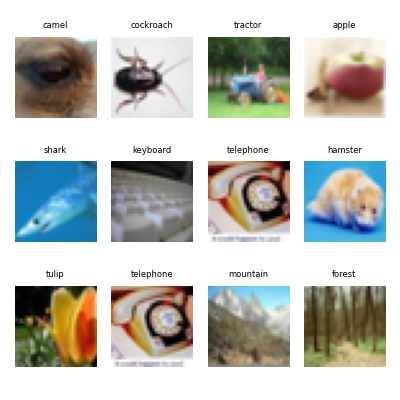
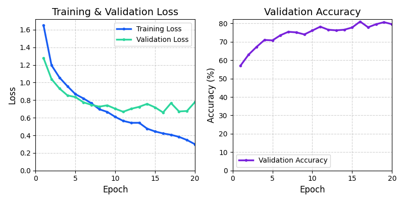
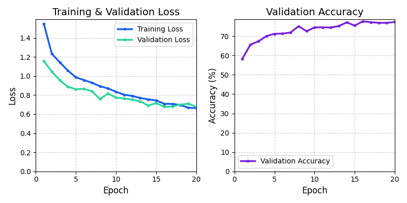

# Description
Train a CNN model based on **CIFAR-100** low resolution(32x32) datasets that can 
classify limited subclasses instead of 100 categories.

We build a intuitive working model that can be trained to do classification first, but with some training issues.
Then we do some improvements and enhancements to tackle the overfitting issues and make structure more graceful.

### scripts descriptions
* **dataset_visualise.py**

    Given the pre-downloaded datasets, load and parse the files to read images and labels.

    Randomly choose some of the images and show them with matplotlib, in order to get an intuition with what form of data that will be processing.

    

* **nature_classifier.py**

    Build a working model that can classify flowers, insects and small animals within small curated classes.

    **Technicals covering:**
    
    * data tranform & normalize
    * data augmentation
    * filter specific subclasses from datasets
    * convolutional layer
    * max pooling
    * flatten to fc layer
    * dropout regularization
    * mini-batch gradient descent
    * evaluate model performence

    **Cautions:**
    
    * Be careful with accumulating the loss in batch and calculate the average loss for total. The loss value returned by loss function is the mean value per batch by default, in order to calculate the total loss based on every sample, you should calculate every batch total loss and accumulate them to get the final one. Otherwise you could calculate average loss based on batch, see `additional` notes below.
    * It's not promised the last batch is a full size, so you should count step by step to get the right size of the sample in a batch.
    * Don't use softmax as the last layer, use Linear layer directly instead. 
    
      `CrossEntropyLoss = LogSoftmax + NLLLoss`
    
    **Additional:**

    There're two different ways of calculating the average loss.
    
    * Batch average
    
      `running_loss += loss.item()`

      `running_loss / len(train_loader)`

    * Sample average

      `running_loss += loss.item() * batch_size`
      
      `running_loss / len(train_dataset)`      

    In this model, we are using the **sample average loss**
    
    ```python
    val_losses = 0.0
    correct = 0
    # Disable gradient descent
    with torch.no_grad():
        for val_images, labels in val_loader:
            outputs = model(val_images)
            batch_avg_loss = loss_func(outputs, labels)
            # accumulate total loss per batch
            val_losses += batch_avg_loss.item() * labels.size(0)
            predicted = torch.argmax(outputs, 1)
            correct += (predicted == labels).sum().item()

        # Calculate the average validation loss
        epoch_val_loss = val_losses / len(val_loader.dataset)
        # Calculate the accuracy
        epoch_accuracy = 100.0 * correct / len(val_loader.dataset)
    ```

    **Model performence:** 
    
    Calculate each loss per epoch, as well as accuracy on validation dataset.

    

    **Note:** The gap between **training_loss** and **validation_loss** shows a clear signs of overfitting. That's what we'll resolve in  `nature_classifier_enhanced.py` next.

* **nature_classifier_enhanced.py**
  
  The performence ploted shows an evident signal to overfitting problems. To tackle this issue, we would do some refactors.

  * data augmentations
  * dropout enhancement
  * weight decay reguluarization
  * add `BatchNorm2d` normalization
  * refactor common codes to module blocks

  **Cautions:**

  * dropout should be implemented **after** activation values
  * normalize should be implemented **before** activations
  

  ```python
  # CNN feature Block
  class CNNBlock(nn.Module):
      
      def __init__(self, in_channels, out_channels, kernel_size, padding, pool_kernel_size, pool_stride):
          super().__init__()
          
          self.conv_layer = nn.Sequential(
              nn.Conv2d(in_channels,out_channels,kernel_size=kernel_size,padding=padding),
              # Batch normalization
              nn.BatchNorm2d(out_channels),
              nn.ReLU(),
              nn.MaxPool2d(pool_kernel_size, pool_stride)
          )

      def forward(self, x):
          return self.conv_layer(x)
      
  # Model
  class SimpleCNN(nn.Module):

      def __init__(self):
          super().__init__()
          
          # layer1
          self.conv1 = CNNBlock(in_channels=3, out_channels=32, kernel_size=3, padding=1, pool_kernel_size=2, pool_stride=2)
          # layer2
          self.conv2 = CNNBlock(in_channels=32, out_channels=64, kernel_size=3, padding=1, pool_kernel_size=2, pool_stride=2)
          # layer3
          self.conv3 = CNNBlock(in_channels=64, out_channels=128, kernel_size=3, padding=1, pool_kernel_size=2, pool_stride=2)

          self.classifier = nn.Sequential(
              nn.Flatten(),
              # Input 32x32, after 3 pooling layers: 4x4
              nn.Linear(128 * 4 * 4, 512),
              nn.ReLU(),
              nn.Dropout(p=0.6),
              nn.Linear(512, len(target_classes))
          ) 

      def forward(self, x):
          # structure is more clear
          x = self.conv1(x)
          x = self.conv2(x)
          x = self.conv3(x)
          x = self.classifier(x)
          return x
  ```
  **Model performence:** 

  Now we can see **training loss** and **validation loss** are more stable and reasonable. But, there's still a plateau to accuracy, we'll do more to improve it later.

  


* **utils.py**

    helper functions assist with main code.


 