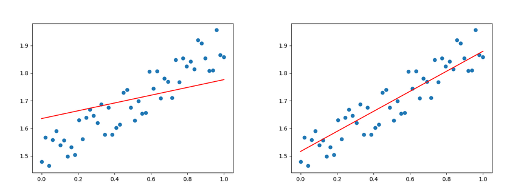
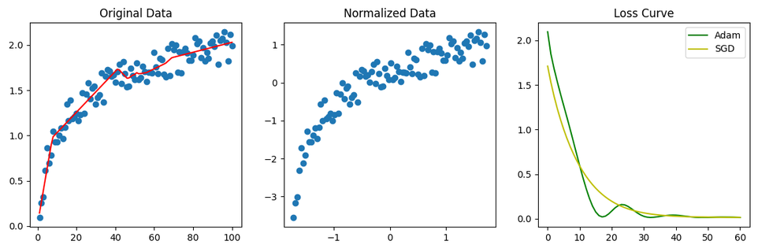

# Fundamentals and Theories

Introduce the fundamentals and basic theories in machine learning with implementations. These're the pivots of next step for the real tasks to train a model. With a solid foundation in conception you could go further during the journey.

## Overview of Machine Learning

Here's the common categories of machine learning according to kinds of tasks.

* Supervised
    * regression model
    * classification model
* Unsupervised
    * clustering
    * anomaly detection
    * dimensionality reduction
* Reinforcement Learning

## Concepts

The basic concepts you should master before hands on.

* linear regression
* logistic regression
* cost function
* gradient descent
* learning rate
* vectorization
* feature scaling with normalization
* regularization
* neural networks architectures
* forward and backward propagation
* activation functions
* clustering with K-means
* anomaly detection with normal distribution
* collaborative filtering
* content based filtering
* PCA
* state-actoin value function
* 

## Basic Trial 

### simple_linear_dynamic.py

This script demonstrates the complete training loop for fitting a simple
single-variable linear model. It creates synthetic observations from the
relationship `y = w * x + b`, adds random noise, and trains a PyTorch
`nn.Linear` layer to recover the underlying weight and bias.

The script also updates a Matplotlib plot while training. Watching the
predicted line move toward the noisy sample data makes the gradual effect of
gradient descent easier to understand.

Basic concepts used:
1. `nn.Linear` as a simple model
2. `torch.linspace` for generating input values
3. `unsqueeze` for reshaping
4. `torch.rand` for generating random noise
5. `nn.MSELoss` for loss function
6. `optim.SGD` for gradient descent
7. `loss.backward()` for backward propagation  
8. `optimizer.step()` for updating

Visualization example

### simple_curve_dynamic.py

This script demonstrates nonlinear regression by fitting noisy `y = log10(x)`
data with a multi-layer neural network. It highlights the importance of
`BatchNorm1d` for normalization and compares `Adam` with `SGD` during training.

Key features:
1. Multi-layer network with `nn.Linear` and `nn.ReLU`
2. Input and hidden-layer normalization with `BatchNorm1d`
3. MSE loss and Adam/SGD optimizer comparison
4. Loss tracking and dynamic Matplotlib visualization

Visualization example:

