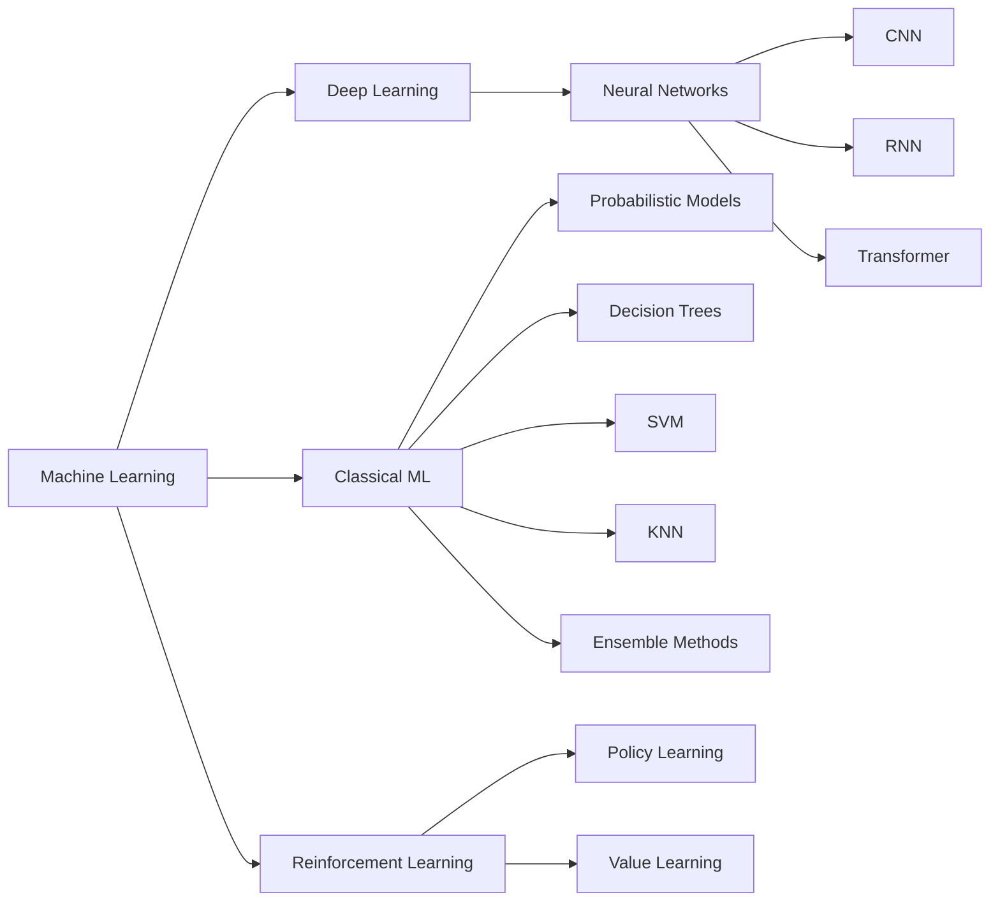

# Practicals and Experiments of Machine Learning and Deep Learning

## Welcome and Foreword
Hi everyone, welcome to my page! 😀

This repository is a collection of my learning notes, experiments, and practical labs in machine learning and deep learning. It is organized by topic and domain, with code examples and notes that reflect my hands-on learning journey.

Machine learning and AI are transforming nearly every aspect of modern life. New models, methods, and releases appear at an accelerating pace, and that rapid evolution is both exciting and motivating. As a software engineer with years of programming experience, I have found machine learning and deep learning both intellectually challenging and practically rewarding.

What started as curiosity gradually grew into a deeper interest in understanding the theory, building models, and applying them to real-world problems. Along the way, I learned that ML is not limited to deep learning alone. It spans a broad landscape of methods, including vision, text, audio, probabilistic models, decision trees, Naive Bayes, support vector machines, clustering, and reinforcement learning. I have also highlighted the core concepts and techniques that I found most useful in practical work.

## Overview of ML workflow

From the initial idea to a production-ready system, a machine learning project typically follows a clear workflow. It usually includes:

* Data Collection
* Data Cleaning and Preparation
* Model Architecture
* Model Training
* Evaluation
* Compression and Deployment

Different types of data may require different preprocessing, training, and evaluation techniques, but the overall workflow remains broadly consistent.

## Knowledge Maps

### Mathematics

A solid foundation in *probability*, *calculus*, and *linear algebra* is essential for understanding how models learn and why they behave the way they do. These concepts support a deeper understanding of training dynamics, optimization, and model behavior in real applications.

Key concepts frequently used in ML include:
* derivative
* vector
* matrix
* linear algebra
* probability distribution
* ...

In practical applications, some common concepts include:
* Naive Bayes
* Laplacian Smoothing
* Log Likelihood
* Cosine Similarity
* ...

### Programming Languages

`Python` is the primary language used throughout this learning journey. It offers a rich ecosystem of tools and libraries that make experimentation, model training, and data analysis efficient and accessible. In addition to Python, I have also worked with *Java*, *C*, *Ruby*, *PHP*, *JavaScript*, and other languages, but Python remains the most practical choice for machine learning work.

### Frameworks and Tools

`PyTorch` is the main deep learning framework used in this project, while `TensorFlow` is another widely adopted option in the field. Both are commonly used for building and training machine learning models.

Beyond the frameworks themselves, tools such as `NumPy`, `Pandas`, `scikit-learn`, and `Matplotlib` are essential for data processing, model evaluation, and visualization. These libraries help transform raw data into meaningful insights and make model comparison more intuitive.

### Model Architectures and Components

I have explored several common model families and classic architectures, including:

* CNN
    * LeNet-5
    * AlexNet
    * VGG-16
    * ResNet
    * Inception Net
    * MobileNet
    * EfficientNet
* RNN
    * GRU
    * LSTM
    * Bi-RNN
* NLP
    * Tokenization
    * Word Embedding (Vector Space Models)
        * KNN
        * ANN (LSH)
    * Sequence-to-Sequence Models
    * Probabilistic Models
        * Naive Bayes Classification Models (Laplacian Smoothing + Log Likelihood)
        * Markov Models
    * Transformer Models
* Transformer
    * Attention Model
    * Encoder
    * Decoder

### Training, Evaluating and Tuning

Models can be built using different architectures, including methods that are not based on neural networks. In general, neural network models are commonly trained using `Gradient Descent`, along with a chosen `Loss Function`, `Optimizer`, and `Scheduler`. During training, it is also important to evaluate the model using appropriate metrics such as `Loss`, `Accuracy`, `Precision`, and `Recall`, while keeping an eye on efficiency and memory usage.

### Optimization and Deployment

Once a model is trained, additional work is often required before it is ready for deployment.

Converting a model to an inference engine is a common step. This may involve exporting it to `ONNX` or another format to support cross-platform deployment and improve runtime performance.

Before deployment, optimization techniques such as `pruning` and `quantization` can significantly reduce model size and improve efficiency. In addition, tools such as `MLflow` can help with experimentation, tracking, and model monitoring throughout the training lifecycle.

## Conclusion

This page is intended to provide a broad overview of my learning journey in machine learning and deep learning. It is still being updated as I continue to explore new topics and deepen my understanding.

All of the notes and annotations here reflect my personal learning process and are not intended as formal teaching material. If you notice any mistakes or have suggestions for improvement, I would be very glad to hear from you.

Thanks for reading!

