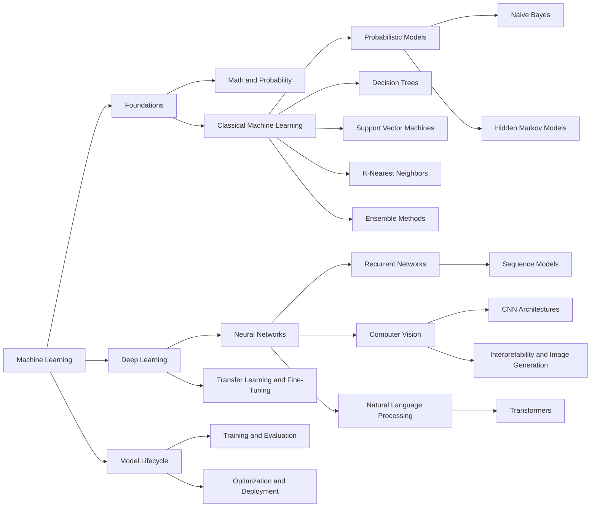

# Practicals and Experiments of Machine Learning and Deep Learning

## Table of Contents

- [Welcome and Foreword](#welcome-and-foreword)
- [Machine Learning Workflow](#machine-learning-workflow)
- [Knowledge Maps](#knowledge-maps)
  - [Mathematics](#mathematics)
  - [Programming Languages](#programming-languages)
  - [Frameworks and Tools](#frameworks-and-tools)
  - [Model Architectures and Components](#model-architectures-and-components)
- [Training, Evaluating and Tuning](#training-evaluating-and-tuning)
- [Optimization and Deployment](#optimization-and-deployment)
- [Conclusion](#conclusion)

## Welcome and Foreword

Welcome! This repository documents my hands-on learning in machine learning and deep learning through study notes, practical experiments, and working code. As a software engineer, I’m interested in connecting the ideas behind a model to how it is implemented, trained, evaluated, and prepared for use.

The knowledge maps and projects bring together the areas I have focused on: machine learning foundations and probabilistic models; neural networks and computer vision; natural language processing (NLP); and transfer learning and fine-tuning. They also cover the practical workflow around these topics, including optimization, evaluation, and deployment. Examples range from classical methods such as Naive Bayes and Hidden Markov Models to CNNs, recurrent networks, and Transformers.

I use this repository to organize concepts, make connections between methods, and build understanding through implementation. It reflects an ongoing learning journey, with an emphasis on clear explanations and practical exploration rather than claiming expertise in every area.

```mermaid
flowchart LR
    ML[Machine Learning]
    ML --> F[Foundations]
    F --> M[Math and Probability]
    F --> CML[Classical Machine Learning]
    CML --> PM[Probabilistic Models]
    PM --> NB[Naive Bayes]
    PM --> HMM[Hidden Markov Models]
    CML --> DT[Decision Trees]
    CML --> SVM[Support Vector Machines]
    CML --> KNN[K-Nearest Neighbors]
    CML --> ENS[Ensemble Methods]

    ML --> DL[Deep Learning]
    DL --> NN[Neural Networks]
    NN --> RNN[Recurrent Networks]
    RNN --> SEQ[Sequence Models]
    NN --> CV[Computer Vision]
    CV --> CNN[CNN Architectures]
    CV --> VI[Interpretability and Image Generation]
    NN --> NLP[Natural Language Processing]
    NLP --> TF[Transformers]

    DL --> ADAPT[Transfer Learning and Fine-Tuning]
    ML --> LIFE[Model Lifecycle]
    LIFE --> TE[Training and Evaluation]
    LIFE --> OD[Optimization and Deployment]
```

## Machine Learning Workflow

From the initial idea to a production-ready system, a machine learning project typically follows a clear workflow. It usually includes:

* Data Collection
* Data Cleaning and Preparation
* Model Architecture
* Model Training
* Evaluation
* Compression and Deployment

Different types of data may require different preprocessing, training, and evaluation techniques, but the overall workflow remains broadly consistent.

## Knowledge Maps

### Mathematics

A solid foundation in *probability*, *calculus*, and *linear algebra* is essential for understanding how models learn and why they behave the way they do. These concepts support a deeper understanding of training dynamics, optimization, and model behavior in real applications.

Key concepts frequently used in ML include:
* derivative
* vector
* matrix
* linear algebra
* probability distribution
* ...

In practical applications, some common concepts include:
* Naive Bayes
* Laplacian Smoothing
* Log Likelihood
* Cosine Similarity
* ...

### Programming Languages

`Python` is the primary language used throughout this learning journey. It offers a rich ecosystem of tools and libraries that make experimentation, model training, and data analysis efficient and accessible. In addition to Python, I have also worked with *Java*, *C*, *Ruby*, *PHP*, *JavaScript*, and other languages, but Python remains the most practical choice for machine learning work.

### Frameworks and Tools

`PyTorch` is the main deep learning framework used in this project, while `TensorFlow` is another widely adopted option in the field. Both are commonly used for building and training machine learning models.

Beyond the frameworks themselves, tools such as `NumPy`, `Pandas`, `scikit-learn`, and `Matplotlib` are essential for data processing, model evaluation, and visualization. These libraries help transform raw data into meaningful insights and make model comparison more intuitive.

### Model Architectures and Components

I have explored several common model families and classic architectures, including:

* CNN
    * LeNet-5
    * AlexNet
    * VGG-16
    * ResNet
    * Inception Net
    * MobileNet
    * EfficientNet
* RNN
    * GRU
    * LSTM
    * Bi-RNN
* NLP
    * Tokenization
    * Word Embedding (Vector Space Models)
        * KNN
        * ANN (LSH)
    * Sequence-to-Sequence Models
    * Probabilistic Models
        * Naive Bayes Classification Models (Laplacian Smoothing + Log Likelihood)
        * Markov Models
    * Transformer Models
* Transformer
    * Attention Model
    * Encoder
    * Decoder
    * Common Models
        * BERT
        * T5
        * Prefix LM

### Training, Evaluating and Tuning

Models can be built using different architectures, including methods that are not based on neural networks. In general, neural network models are commonly trained using `Gradient Descent`, along with a chosen `Loss Function`, `Optimizer`, and `Scheduler`. During training, it is also important to evaluate the model using appropriate metrics such as `Loss`, `Accuracy`, `Precision`, and `Recall`, while keeping an eye on efficiency and memory usage.

### Optimization and Deployment

Once a model is trained, additional work is often required before it is ready for deployment.

Converting a model to an inference engine is a common step. This may involve exporting it to `ONNX` or another format to support cross-platform deployment and improve runtime performance.

Before deployment, optimization techniques such as `pruning` and `quantization` can significantly reduce model size and improve efficiency. In addition, tools such as `MLflow` can help with experimentation, tracking, and model monitoring throughout the training lifecycle.

## Overview of Projects

### Fundamentals of Machine Learning

### Text and NLP Models

The Text-and-NLP projects explore an end-to-end path from raw text to language applications. They cover tokenization and vocabulary building, word embeddings, and traditional sequence models such as RNNs and LSTMs. Practical tasks include text classification, named entity recognition, sentiment analysis, next-word prediction, text generation, summarization, and question answering. The Transformer examples build up positional encoding, attention, encoder and decoder components, while algorithm exercises introduce n-gram prediction and minimum edit distance.

[Explore the Text and NLP projects](./Text-and-NLP/README.md) for explanations and examples, including [tokenization](./Text-and-NLP/tokenization.py), [text classification](./Text-and-NLP/text_classifier.py), [LSTM-based named entity recognition](./Text-and-NLP/lstm_ner.py), [Transformer summarization](./Text-and-NLP/transformer_summary.py), and [n-gram prediction](./Text-and-NLP/n_grams_predict.py).

### Vision Models

The VisionLab projects centered on PyTorch and convolutional neural networks. They focus on how CNNs interpret images, explain how certain regions matter for recognition and how modern generative models create new visual content from noise as `diffusion model`. The experiments cover feature maps, saliency analysis, Grad-CAM-style class activation mapping, and diffusion-based image generation, showing both the interpretability and creativity of modern vision systems.

These works help build intuition for core computer vision ideas: visualizing intermediate activations, highlighting influential pixels, explaining model decisions, and exploring denoising for image synthesis.

### Deployment

The Deployment projects focus on the final stage of the ML lifecycle: turning a trained model into something reusable, portable, and efficient in real-world use. These examples cover checkpoint saving and training resume, model serialization, experiment tracking with Lightning and MLflow, exporting to ONNX for cross-platform inference, and optimization through pruning and quantization. The goal is to move from a notebook-trained model to a deployment-ready workflow with better reliability and performance.

[Explore the Deployment projects](./Deployment/README.md) for checkpointing, ONNX export, and model optimization examples.

## Conclusion

This page is intended to provide a broad overview of my learning journey in machine learning and deep learning. It is still being updated as I continue to explore new topics and deepen my understanding.

All of the notes and annotations here reflect my personal learning process and are not intended as formal teaching material. If you notice any mistakes or have suggestions for improvement, I would be very glad to hear from you.

Thanks for reading!
