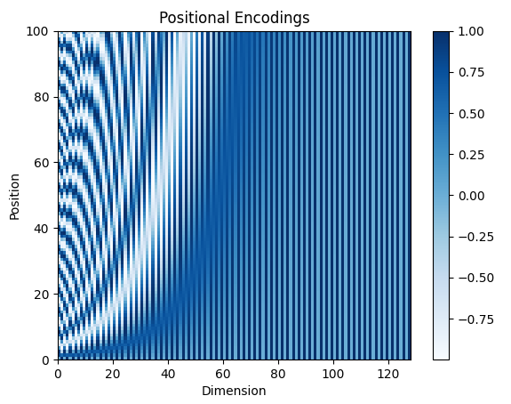

# Text Processing and NLP Applications

Text is one of the most common data formats in the real world and is central to many machine-learning applications.

This part of the project covers how to preprocess and encode text, then apply several models to practical NLP tasks. It moves from raw, unstructured text to predictive models, progressing from simple probabilistic methods to Transformer architectures.

- [Preprocess: From Corpus to Vocabulary ](#preprocess-from-corpus-to-vocabulary)
    - [Data collection and cleaning](#data-collection-and-cleaning)
    - [Tokenization](#tokenization)
    - [Build Vocabulary](#build-vocabulary)
- [Word Representations: Embeddings](#word-representations-and-embeddings)
    - [Create an embedding model](#create-an-embedding-model)
    - [Text classification](#text-classification)
- [Models and Applications](#models-and-applications)
    - [RNN](#rnn)
    - [GRU](#gru)
    - [LSTM](#lstm)
        - [Named Entity Recognition](#named-entity-recognition-ner)
    - [Transformer](#attention-and-transformer)
        - [Positional Encodings](#positional-encodings)
        - [Attention](#scaled-dot-product-attention)
        - [Encoder](#encoder)
        - [Decoder](#decoder)
        - [Summarization Application](#summarization-with-transformer)
- [Algorithms](#common-algorithms)
    - [Min Edit Distance](#min-edit-distance)
    - [HMM and Viterbi](#hmm-and-viterbi)
    - [N-gram probabilities](#n-gram-probabilities)


## Preprocess: From Corpus to Vocabulary 

### Data collection and cleaning

A corpus is a collection of text used to build or train a model. Before tokenization, inspect the properties that affect the task:

* letter case
* punctuation
* numbers
* special characters
* emoji

Tools such as `NLTK` and `emoji` can make text preparation easier, but preprocessing decisions should be based on the task and model.

```python
import nltk
nltk.download('punkt')

corpus ='Which team is the "CHAMPION" of the World Cup 2026? ❤️ ESPANA!!!'
# replace punctuations
data = re.sub(r'[,!?;-]+',corpus)
# tokenize
data = nltk.word_tokenize(data)
# turn to lower case
data = [ch.lower() for ch in data]
```

### Tokenization

The next step is to split sentences into smaller units called **tokens**. Tokenization only determines the boundaries and content of these units; it does not yet assign them numeric IDs.

Tokenizers use different granularities and methods:

* Words
* **Subwords**
  * WordPiece
  * BPE
  * SentencePiece
* Characters

Subwords are common because they can represent both frequent words and previously unseen words. The appropriate strategy depends on the model and task.

#### Pre-trained Tokenizer and Numerical Encoding

In most cases we will not build a tokenizer from scratch. A pre-trained tokenizer from `Hugging Face Transformers` is usually a better choice. Here we use `BERT` and `GPT` for practice.

**Remark:** `AutoTokenizer` automatically selects the tokenizer configuration required by a model. A pre-trained tokenizer normally combines three operations: splitting text into tokens, mapping tokens to its existing vocabulary, and converting them into token IDs. Therefore, the BERT and GPT examples below show both tokens and their numeric representations.

[tokenization.py](./tokenization.py)

```python
def get_tokenizer(tk_name):

    # `AutoTokenizer` is a better way in product, 
    # but for practice we specified tokenizer's type respectively
    if tk_name and tk_name.strip().lower() == "gpt":
        tokenizer = GPT2TokenizerFast.from_pretrained("gpt2")
        # should set `eos_token` as padding for GPT2
        tokenizer.pad_token = tokenizer.eos_token
    elif tk_name and tk_name.strip().lower() == "bert":
        tokenizer = BertTokenizerFast.from_pretrained("bert-base-uncased")
    else:
        tokenizer = AutoTokenizer.from_pretrained(tk_name)

    return tokenizer
```

BERT Tokens:
> [['[CLS]', 'i', "'", 'm', 'feeling', 'happy', 'today', 'because', 'doing', 'deep', '##lea', '##rn', '##ing', '[SEP]'],<br/>
> ['[CLS]', 'don', "'", 't', 'drop', 'garbage', 'anywhere', 'in', 'din', '##ning', 'room', '~', '[SEP]', '[PAD]']]<br/>

BERT Token IDs:
>tensor([[  101,  1045,  1005,  1049,  3110,  3407,  2651,  2138,  2725,  2784,
         19738,  6826,  2075,   102],
        [  101,  2123,  1005,  1056,  4530, 13044,  5973,  1999, 11586,  5582,
          2282,  1066,   102,     0]])

GPT Tokens:
> [['I', "'m", 'Ġfeeling', 'Ġhappy', 'Ġtoday', 'Ġbecause', 'Ġdoing', 'Ġdeep', 'learning', '<|endoftext|>'], <br/>
> ['Don', "'t", 'Ġdrop', 'Ġgarbage', 'Ġanywhere', 'Ġin', 'Ġdin', 'ning', 'Ġroom', '~']]

GPT Token IDs:
> tensor([[   40,  1101,  4203,  3772,  1909,   780,  1804,  2769, 40684, 50256],[ 3987,   470,  4268, 15413,  6609,   287, 16278,   768,  2119,    93]])

### Remove Stop Words

Stop words are frequent words such as `the`, `is`, and `of` that often contribute little to a particular task. Removing them can reduce the vocabulary size for traditional text-processing workflows, although they should usually be kept when word order or sentence meaning matters.

### Apply Stemming

Stemming reduces related words to a common root by removing or modifying word endings. For example, `connect`, `connected`, and `connecting` may be reduced to a similar stem. It is simple and fast, but the resulting stems are not always valid words.

### Build Vocabulary

For a custom word-level pipeline, collect the unique tokens from the training corpus to build a vocabulary. Assign each token an integer ID and reserve special tokens such as `<pad>`, `<unk>`, `<sos>` and `<eos>`. This mapping is then used for **numericalization**, which converts a token sequence such as `['hello', 'world']` into an ID sequence such as `[12, 45]`.

Use the **training split** to build the vocabulary so that validation and test data do not leak information into the model. When using a pre-trained BERT or GPT tokenizer, do not build a new vocabulary; use the vocabulary supplied with that tokenizer instead.

## Word Representations and Embeddings

Embedding models have evolved from classic static representations to contextual representations that can reflect a word's meaning in context. Here we create a simple static embedding model as an introduction; its training setup is loosely related to the distributional idea behind `Word2Vec`.

In real-world applications, pretrained embeddings or pretrained language models are often a practical starting point.

### Create an embedding model

We build a model with two layers: `nn.Embedding` looks up a vector for each token ID, and `nn.Linear` maps that vector to vocabulary logits for prediction.

[embedding_model.py](./embedding_model.py)

```python
class MyEmbeddingModel(nn.Module):

    def __init__(self, vocab_size, embedding_dim):
        super().__init__()
        
        # embedding layer
        self.embedding = nn.Embedding(vocab_size, embedding_dim)
        # linear layer
        self.linear = nn.Linear(embedding_dim, vocab_size)

    def forward(self, context):
        embedded_vector = self.embedding(context)
        # Note: you could input several words with context window,
        # in that case, you would using average or sum of context tensor like `CBOW` do
        # embedded_avg = torch.mean(embedded_vector, dim=1)

        # for simplicity, we just use one-to-one training pair
        output = self.linear(embedded_vector)
        return output, embedded_vector
```

We manually prepare `(input, output)` word pairs to train this small model instead of using a large corpus.

```python
# just for sample
vocabulary = ["car", "bike", "plane", "boat",
                  "cat", "dog", "bird", "horse",
                  "orange", "apple", "grape", "banana"]
train_data = [
        ('car', 'bike'),  # format: (input, label)
        ('bird', 'cat'),
        ('orange', 'apple'),
]
```

After training, we extract the embedding weights and use `scikit-learn`'s `PCA` to project the high-dimensional vectors into two dimensions. This provides a visual way to inspect the learned representation.


Contextual embeddings are more expressive because the representation can depend on surrounding tokens, but they require more computation. `BERT` and `GPT` are well-known Transformer-based examples; the appropriate model depends on the task and available resources.

## Models and Applications

### RNN

[rnn_model.py](./rnn_model.py)

A vanilla RNN processes sequential data by reusing the same cell at each time step. At step $t$, it updates the hidden state using the current input and the previous hidden state:

$$
h_t = \tanh(W_{xh}x_t + W_{hh}h_{t-1} + b)
$$

In this PyTorch version, the recurrent unit is implemented as a small module with two linear transforms:

```python
out = self.W_xh(x_t) + self.W_hh(h_prev)
h_t = torch.tanh(out)
```

This means:

- `W_xh` projects the current input into hidden space
- `W_hh` projects the previous hidden state into the next hidden state
- `tanh` adds nonlinearity
- the same weights are reused across all time steps

The model then loops over the full sequence and keeps passing the hidden state forward. The final output is a sequence of hidden states, and the last hidden state can be used as the representation of the whole sequence for downstream prediction.

This is the core idea behind vanilla RNNs: memory is carried through time. However, simple RNNs can struggle with long-range dependencies, which is why GRU and LSTM were introduced later.

### GRU

Gated Recurrent Unit (GRU) is a recurrent neural network designed to improve on vanilla RNNs by adding gates that decide what information to keep and what to forget over time. It uses a reset gate and an update gate to balance new information with past context, making it effective for modeling short and medium-length sequential dependencies.

Compared with LSTM, GRU has a simpler structure with fewer parameters, which often makes it faster to train and easier to tune.

### LSTM

[lstm_ner.py](./lstm_ner.py)

Long Short-Term Memory (LSTM) is a type of recurrent neural network designed to capture long-range dependencies in sequential data. Unlike a basic RNN, LSTM introduces memory cells and gates to control what information to keep, forget, and update across time steps. This makes it effective for text processing tasks where word order and context matter.

In the script `lstm_ner.py`, each token is first mapped to an embedding vector and then processed by a bidirectional LSTM. The LSTM reads the sentence from both left to right and right to left, allowing the model to use context from both directions when predicting a label for each token.

#### Named Entity Recognition (NER)

Named Entity Recognition is a sequence labeling task. The model predicts whether each token belongs to entity labels such as `B-per`, `I-per`, `B-geo`, `I-geo`, `B-org`, `I-org`, or `O`, which indicate the beginning and inside of person, location, organization, and non-entity spans. In this project, each word is assigned a tag and the model learns to classify each token in context.

The training data comes from Kaggle's [Annotated Corpus for Named Entity Recognition](https://www.kaggle.com/datasets/abhinavwalia95/entity-annotated-corpus).


The basic pipeline in `lstm_ner.py` is:

- build a vocabulary from the dataset
- map words and labels to integer IDs
- pad sequences in batches
- feed token embeddings into Bi-LSTM
- apply a linear classifier on each time step
- train with cross-entropy loss over token-level labels

This is a standard setup for NER: using contextualized word representations from the LSTM to predict the most likely tag for every token in the sentence.

After training, test the model with another sample:

```python
# test a sample after training
sample = "Tom and Lily flew to France on Friday morning when they were in Beijing during vacation .".split(" ")

tks = [w2i.get(tok, w2i["<unk>"]) for tok in sample]

model.eval()
with torch.no_grad():
    output = model(torch.tensor([tks]).long())
    indices = torch.argmax(output, dim=-1)
    tags = [idx2tag[i.item()] for i in indices[0]]
    print(f"input tokens: {tks}")
    print(f"NER tags: {tags}")
```

> input tokens: [3947, 13, 16290, 16290, 7, 1893, 63, 365, 3525, 278, 127, 189, 11, 1634, 194, 16290, 21] </br>
> NER tags: ['O', 'O', 'O', 'O', 'O', 'B-geo', 'O', 'B-tim', 'I-tim', 'O', 'O', 'O', 'O', 'B-geo', 'O', 'O', 'O']

### Text Classification

In this example, we use a simplified dataset derived from [Food.com Recipes and User Interactions](https://www.kaggle.com/datasets/shuyangli94/food-com-recipes-and-user-interactions). It includes a recipe name, ingredients, steps, category, and label. The goal is to classify a recipe as a fruit or vegetable recipe based on its name. The data is stored in `.csv` format and processed with pandas:

|    |     id | name                             | category   | label |
|---:|-------:|:---------------------------------|:-----------|:------|
|  0 |  31490 | a bit different  breakfast pizza | vegetable  | 1     |
|  1 | 112140 | all in the kitchen  chili        | vegetable  | 1     |
|  2 |  59389 | alouette  potatoes               | vegetable  | 1     |
|  3 |   5289 | apple a day  milk shake          | fruit      | 0     |
|  4 |  70971 | bananas 4 ice cream  pie         | fruit      | 0     |

Before training a model, the data must still be prepared and batched.

Sentences normally have different lengths, but efficient batch processing requires a consistent representation. Two common approaches are:

1. Pad sentences to the same length and provide a corresponding mask. Padding is useful when the model processes a dense batch tensor.

    ```python
    def collate_batch_padding(batch_samples):
        """
        Formats a batch by padding
        """
        labels = torch.tensor([item['label'] for item in batch_samples])
        texts = [item['text'] for item in batch_samples]
        # find the max length in batch
        max_len = max(len(text) for text in texts)
        # create a tensor of max size, filled with zeros
        padded_texts = torch.zeros(len(texts), max_len, dtype=torch.long)
        # copy each text sequence into the padded tensor
        for i, text in enumerate(texts):
            padded_texts[i, :len(text)] = text
            
        return padded_texts, labels
    ```

2. Concatenate all tokens into one flattened tensor and supply `offset` indices for each sentence. This is the approach used by `nn.EmbeddingBag`.

    ```python
    def collate_batch_flatten(batch_samples):
        """
        Formats a batch by flatten
        """
        labels = torch.tensor([item['label'] for item in batch_samples])
        texts = [item['text'] for item in batch_samples]
        # create a list of the lengths of each text, prepended with 0.
        offsets = [0] + [len(text) for text in texts]
        offsets = torch.tensor(offsets[:-1]).cumsum(dim=0)
        # concatenate
        flattened_text = torch.cat(texts)
        
        return flattened_text, offsets, labels
    ```

Using the `collate_fn` parameter of a `DataLoader` allows batches to be padded or flattened dynamically.

[text_classifier.py](./text_classifier.py)

We use the flattened approach with `nn.EmbeddingBag` in a simple architecture consisting of an embedding layer, dropout, and a fully connected layer.

```python
class EmbeddingBagClassifier(nn.Module):
    """
    A simple text classifier using nn.EmbeddingBag
    """
    def __init__(self, vocab_size, embedding_dim, num_classes):
        super().__init__()
        # using average strategy
        self.embedding_bag = nn.EmbeddingBag(vocab_size, embedding_dim, mode='mean')
        self.dropout = nn.Dropout(0.5)
        self.fc = nn.Linear(embedding_dim, num_classes)

    def forward(self, text, offsets=None):
        embedded = self.embedding_bag(text, offsets)
        embedded = self.dropout(embedded)
        return self.fc(embedded)
```

### Attention and Transformer

The Transformer is a neural architecture used in models such as BERT and GPT. Its key mechanism is **attention**, which allows each token to model its relationship with other tokens in the same sequence in parallel.

Unlike recurrent models, which process tokens sequentially, attention computes dependencies across the whole sequence at once. This makes it effective for long-range context modeling and parallel training.

In this section, we first describe attention using `Q`, `K`, and `V`, then introduce the core Transformer components: the encoder, decoder, and encoder-decoder arrangement.

#### Positional Encodings

[position_encoding.py](./position_encoding.py)

Multi-head self-attention processes all tokens in parallel, so it does not know their order by itself. Positional information is therefore added to the token embeddings. This project uses fixed sine/cosine encodings in `encoder_classifier.py` and `decoder_generator.py`; learned positional embeddings are another valid approach.

$$
PE_{(pos, 2i)} = \sin\left(\frac{pos}{10000^{2i/d_{model}}}\right)
$$

$$
PE_{(pos, 2i+1)} = \cos\left(\frac{pos}{10000^{2i/d_{model}}}\right)
$$

$$
X' = X + PE
$$

Here, $pos$ is the token position, $i$ indexes a pair of embedding dimensions,
and $d_{model}$ is the embedding dimension. Even dimensions use sine and odd
dimensions use cosine. Because the encoding is deterministic, it has no trainable parameters.



#### Scaled dot-product attention

Scaled dot-product attention is the fundamental building block of Transformer models. Given query matrix $Q$, key matrix $K$, and value matrix $V$, the attention score is computed as:

$$
\mathrm{Attention}(Q, K, V) = \mathrm{softmax}\left(\frac{QK^T}{\sqrt{d_k}}\right)V
$$

where $d_k$ is the dimension of the key vectors. Dividing by $\sqrt{d_k}$ keeps the scale of the scores stable and prevents large dot products from dominating the softmax.

When a mask is provided, it is usually applied before softmax to prevent invalid positions from receiving attention probability, for example by setting masked values to $-\infty$ or a very small number.

```python
def dot_product_attention(q, k, v, mask=None):
    scores = torch.matmul(q, k.transpose(-1, -2))
    dk = k.size(-1)
    scores = scores / math.sqrt(dk)

    if mask is not None:
        scores = scores.masked_fill(mask == 0, float('-inf'))

    attention_weights = torch.softmax(scores, dim=-1)
    output = torch.matmul(attention_weights, v)
    return output
```

Shapes of `Q`, `K`, and `V`:

```text
q: (batch_size, num_heads, query_length, head_dimension)
k: (batch_size, num_heads, key_length, head_dimension)
v: (batch_size, num_heads, key_length, value_dimension)
```

[self_attn_predict.py](./self_attn_predict.py)

A prediction model using self-attention. It is trained with a sliding window to predict the next word. The main process includes:

1. tokenizer
2. embedding + positioning
3. attention calculation with Q,K,V
4. train with sentences
5. show attention in heat map
6. predict next words

After training on a small corpus, we provide the sentence "I and tom go to" and ask the model to predict the next two words. We also display an attention heat map to make the learned relationships easier to inspect.


> ['i', 'and', 'tom', 'go', 'to', 'the'] <br/>
> ['i', 'and', 'tom', 'go', 'to', 'the', 'park']

#### Encoder

[encoder_classifier.py](./encoder_classifier.py)

A sentiment analysis model with an encoder architecture. It includes the main Transformer components:

1. Layer Normalization
2. Sinusoidal Positional Encoding
3. Multi-head Attention
4. Residual Connection
5. FeedForward Network

The training data comes from the [IMDB](https://ai.stanford.edu/~amaas/data/sentiment/aclImdb_v1.tar.gz) dataset; this practice uses only a subset.


#### Decoder

[decoder_generator.py](./decoder_generator.py)

The decoder is the autoregressive part of a Transformer that can generate a sequence one token at a time. Its key mechanism is masked self-attention with `causal masking`, which prevents a position from attending to future positions.

In this part we'll include:

* causal masking
* positional encoding
* padding mask
* decode block

```python
def create_causal_mask(size: int, is_bool=True):
    if is_bool:
        mask = torch.ones(size, size)
        mask = torch.triu(mask, diagonal=1).bool()
    else:
        mask = torch.full((size, size), float('-inf'))
        mask = torch.triu(mask, diagonal=1)
    return mask
```

We use the `IMDB` dataset again with a lightly modified tokenizer. Positional encoding, decoder blocks, and multi-head attention follow the same general ideas as the encoder, with causal masking added for generation:

1. Pass the **causal mask to the multi-head attention** block.
2. Use `nn.TransformerDecoderLayer` in a decoder-only configuration. Although the PyTorch layer supports cross-attention, this project passes the same sequence as the target and memory.
3. During training, use the same sequence as the source while shifting the target by one position for next-token prediction.
4. Use `top-k` and `top-p` sampling to control predictions.
5. Use `temperature` to adjust the sharpness of the probability distribution.
6. Use `torch.multinomial` to sample from the distribution.
7. Use `yield` to generate one token at a time.

After training on a small corpus, we provide **"The film"** as a prompt and let the model generate the following tokens. The example uses only five epochs and 1,000 movie reviews, so its output is illustrative rather than a measure of production-level language quality.

> **prompt**: The film <br/>
> **generated**: The Film is a french film as an excellent of a legendary father , however . crawford ( william haines ) and bonnie jordan with his bowl ursula buchfellner to their cheating leopold kessler ( dell henderson ) in germany peter weston together in her chess star — , becomes legend bobby fischer . evelyn ransom on her husband from georgia watson ) penniless ; bonnie they suddenly deciding to her autograph advantage ( werner pochath ) . william haines is herself to him but unlike urban architecture by dr , mary ellen trainor laura crawford who becomes

#### Summarization with Transformer

[transformer_summary.py](./transformer_summary.py)

This example uses a Transformer encoder-decoder architecture to train a summarization model on a curated CSV dataset from [Kaggle.com](https://www.kaggle.com/datasets/sunnysai12345/news-summary) containing source articles and reference summaries.

Key techniques used:

- Clean and shuffle the source articles and reference summaries.
- Train a compact `WordPiece` tokenizer on the source articles and reference summaries.
- Use dynamic batch padding with a custom collate function.
- Share token embeddings between the encoder and decoder.
- Add sinusoidal positional encodings to represent token order.
- Apply causal masking for autoregressive decoding.
- Apply source and target padding masks during attention.
- Use teacher forcing with the target sequence shifted by one token.

This experiment showed that good summarization depends on more than the Transformer architecture. The tokenizer, vocabulary size, learning rate, and dataset quality must match the size of the training corpus. 


## Common Algorithms

### Min Edit Distance

[min_edit_distance.py](./min_edit_distance.py)

Minimum edit distance is a dynamic-programming algorithm that measures the cost of transforming one string into another. In this implementation, the three operations are insertion, deletion, and replacement, with default costs of 1, 1, and 2, respectively. A matrix stores the minimum cost of converting each source prefix into each target prefix. This is useful for comparing strings, correcting typos, and aligning text.

```text
   #  p  r  o  c  e  e  d
#  0  1  2  3  4  5  6  7
p  1  0  1  2  3  4  5  6
r  2  1  0  1  2  3  4  5
e  3  2  1  2  3  2  3  4
c  4  3  2  3  2  3  4  5
e  5  4  3  4  3  2  3  4
d  6  5  4  5  4  3  4  3
e  7  6  5  6  5  4  3  4
```

### HMM and Viterbi

Hidden Markov Models (HMMs) are probabilistic sequence models that assume each hidden state emits observations over time, making them well suited for POS tagging, chunking, and speech recognition. The Viterbi algorithm efficiently finds the most likely sequence of hidden states by dynamic programming, balancing transition and emission probabilities while keeping the best path for each prefix.

### N-gram probabilities

[n_grams_predict.py](./n_grams_predict.py)

An n-gram is a simple probabilistic language model that estimates the likelihood of a word based on the previous $n-1$ words. N-grams are useful for next-word prediction and text generation, and are easy to implement and fast to train. They capture local context but struggle with long-range dependencies and unseen word combinations.

The core idea of an n-gram model is to estimate the probability of each possible next word given the previous $n-1$ words. In practice, this example counts observed word combinations and normalizes the counts into conditional probabilities.

The co-occurrence matrix:

```text
               i  like  this  dog   is    a  cat  </s>  <unk>
(<s>, this)  0.0   0.0   0.0  1.0  0.0  0.0  0.0   0.0    0.0
(is, like)   0.0   0.0   0.0  0.0  0.0  1.0  0.0   0.0    0.0
(like, a)    0.0   0.0   0.0  0.0  0.0  0.0  2.0   0.0    0.0
(a, cat)     0.0   0.0   0.0  0.0  0.0  0.0  0.0   2.0    0.0
(<s>, <s>)   1.0   0.0   1.0  0.0  0.0  0.0  0.0   0.0    0.0
(this, dog)  0.0   0.0   0.0  0.0  1.0  0.0  0.0   0.0    0.0
(<s>, i)     0.0   1.0   0.0  0.0  0.0  0.0  0.0   0.0    0.0
(i, like)    0.0   0.0   0.0  0.0  0.0  1.0  0.0   0.0    0.0
(dog, is)    0.0   1.0   0.0  0.0  0.0  0.0  0.0   0.0    0.0
```

The probabilities matrix:

```text
                    i      like      this       dog       cat        is         a      </s>     <unk>
(dog, is)    0.100000  0.200000  0.100000  0.100000  0.100000  0.100000  0.100000  0.100000  0.100000
(like, a)    0.090909  0.090909  0.090909  0.090909  0.272727  0.090909  0.090909  0.090909  0.090909
(this, dog)  0.100000  0.100000  0.100000  0.100000  0.100000  0.200000  0.100000  0.100000  0.100000
(is, like)   0.100000  0.100000  0.100000  0.100000  0.100000  0.100000  0.200000  0.100000  0.100000
(<s>, i)     0.100000  0.200000  0.100000  0.100000  0.100000  0.100000  0.100000  0.100000  0.100000
(a, cat)     0.090909  0.090909  0.090909  0.090909  0.090909  0.090909  0.090909  0.272727  0.090909
(<s>, this)  0.100000  0.100000  0.100000  0.200000  0.100000  0.100000  0.100000  0.100000  0.100000
(<s>, <s>)   0.181818  0.090909  0.181818  0.090909  0.090909  0.090909  0.090909  0.090909  0.090909
(i, like)    0.100000  0.100000  0.100000  0.100000  0.100000  0.100000  0.200000  0.100000  0.100000
```


