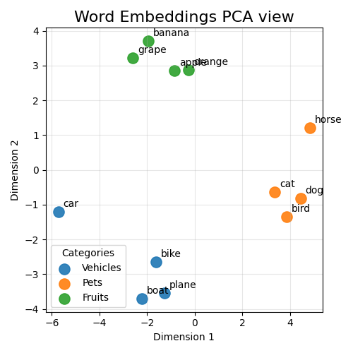
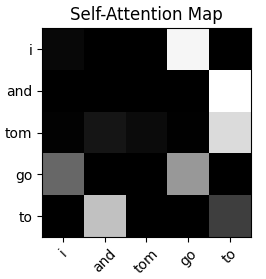
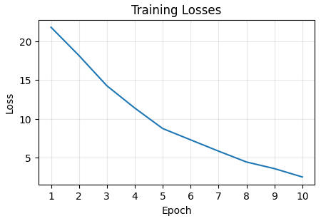
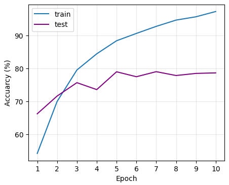

# Text processing and NLP applications

Text is one of the most common data format we used in real world therefore becoming one of the pivots in the machine learning.

In this part of project we'll discover how to process text and how to encode it properly for processing at the start. Then we'll apply it to a variety of tasks with different methods, from simple probabilistic model to complicated transformer.
We'll move from raw, unstructured text to a functional predictive model, covering the main workflows of NLP task.

- [Preprocess: From Corpus to Vocabulary ](#preprocess-from-corpus-to-vocabulary)
    - tokenization.py
- [Word Representations: Embeddings](#word-representations-and-embeddings)
    - embedding_model.py
- [Models and Applications](#models-and-applications)
    - text_classifier.py
    - self_attn_predict.py
    - encoder_classifier.py
    - decoder_generator.py
- [Algorithms](#common-algorithms)
    - min_edit_distance.py
    - HMM and viterbi
    - N-grams probabilities


## Preprocess: From Corpus to Vocabulary 

### Data collection and cleaning

Corpus consists of a full context with predicted words and other symbols, you need to clean them at first to build a vocabulary. What would be taken into account includes:

* case sensitive
* punctuations
* numbers
* special characters
* emoji
* ...

There're various of tools for pre-processing the raw text such as `NLTK`, `emoji` libraries etc. By using these tools make it much easier and efficient for data preparation.

```python
import nltk
nltk.download('punkt')

corpus ='Which team is the "CHAMPION" of the World Cup 2026? ❤️ ESPANA!!!'
# replace punctuations
data = re.sub(r'[,!?;-]+',corpus)
# tokenize
data = nltk.word_tokenize(data)
# turn to lower case
data = [ch.lower() for ch in data]
```

### Tokenization

The next step is to split sentences into smaller units called **tokens**. Tokenization only determines the boundaries and content of these units; it does not yet assign them numeric IDs.

There're different granularities and methods of tokenization, let's take a glance:

* Words
* **Subwords**
  * WordPiece
  * BPE
  * SentencePiece
* Characters

Subwords are common because they can represent both frequent words and previously unseen words. The appropriate strategy depends on the model and task.

#### Pre-trained Tokenizer and Numerical Encoding

In most cases we will not build a tokenizer from scratch. A pre-trained tokenizer from `Hugging Face Transformers` is usually a better choice. Here we use `BERT` and `GPT` for practice.

**Remark:** `AutoTokenizer` automatically selects the tokenizer configuration required by a model. A pre-trained tokenizer normally combines three operations: splitting text into tokens, mapping tokens to its existing vocabulary, and converting them into token IDs. Therefore, the BERT and GPT examples below show both tokens and their numeric representations.

[tokenization.py](./tokenization.py)

```python
def get_tokenizer(tk_name):

    # `AutoTokenizer` is a better way in product, 
    # but for practice we specified tokenizer's type respectively
    if tk_name and tk_name.strip().lower() == "gpt":
        tokenizer = GPT2TokenizerFast.from_pretrained("gpt2")
        # should set `eos_token` as padding for GPT2
        tokenizer.pad_token = tokenizer.eos_token
    elif tk_name and tk_name.strip().lower() == "bert":
        tokenizer = BertTokenizerFast.from_pretrained("bert-base-uncased")
    else:
        tokenizer = AutoTokenizer.from_pretrained(tk_name)

    return tokenizer
```

BERT Tokens:
> [['[CLS]', 'i', "'", 'm', 'feeling', 'happy', 'today', 'because', 'doing', 'deep', '##lea', '##rn', '##ing', '[SEP]'],<br/>
> ['[CLS]', 'don', "'", 't', 'drop', 'garbage', 'anywhere', 'in', 'din', '##ning', 'room', '~', '[SEP]', '[PAD]']]<br/>

BERT Token IDs:
>tensor([[  101,  1045,  1005,  1049,  3110,  3407,  2651,  2138,  2725,  2784,
         19738,  6826,  2075,   102],
        [  101,  2123,  1005,  1056,  4530, 13044,  5973,  1999, 11586,  5582,
          2282,  1066,   102,     0]])

GPT Tokens:
> [['I', "'m", 'Ġfeeling', 'Ġhappy', 'Ġtoday', 'Ġbecause', 'Ġdoing', 'Ġdeep', 'learning', '<|endoftext|>'], <br/>
> ['Don', "'t", 'Ġdrop', 'Ġgarbage', 'Ġanywhere', 'Ġin', 'Ġdin', 'ning', 'Ġroom', '~']]

GPT Token IDs:
> tensor([[   40,  1101,  4203,  3772,  1909,   780,  1804,  2769, 40684, 50256],[ 3987,   470,  4268, 15413,  6609,   287, 16278,   768,  2119,    93]])

### Remove Stop Words

Stop words are frequent words such as `the`, `is`, and `of` that often contribute little to a particular task. Removing them can reduce the vocabulary size for traditional text-processing workflows, although they should usually be kept when word order or sentence meaning matters.

### Apply Stemming

Stemming reduces related words to a common root by removing or modifying word endings. For example, `connect`, `connected`, and `connecting` may be reduced to a similar stem. It is simple and fast, but the resulting stems are not always valid words.

### Build Vocabulary

For a custom word-level pipeline, collect the unique tokens from the training corpus to build a vocabulary. Assign each token an integer ID and reserve special tokens such as `<pad>`, `<unk>`, `<sos>` and `<eos>`. This mapping is then used for **numericalization**, which converts a token sequence such as `['hello', 'world']` into an ID sequence such as `[12, 45]`.

Use the **training split** to build the vocabulary so that validation and test data do not leak information into the model. When using a pre-trained BERT or GPT tokenizer, do not build a new vocabulary; use the vocabulary supplied with that tokenizer instead.

## Word Representations and Embeddings

Embedding models evolute from classic static to modern contextual ones which can handle multiple meanings of the word according to the context. Here we'll create a simple classic embedding model to get start. The architecture somewhat like the way of `Word2Vec`, a static embedding method.

Same as before, in real-world applications you won't create embeddings from scratch. Usually you'll use them by mature models as libraries. 

### Create an embedding model

We build a model with tow layers, one for look up embeddings, the other for mapping to indices. That is to say `nn.Embedding` layer and `nn.Linear`.

[embedding_model.py](./embedding_model.py)

```python
class MyEmbeddingModel(nn.Module):

    def __init__(self, vocab_size, embedding_dim):
        super().__init__()
        
        # embedding layer
        self.embedding = nn.Embedding(vocab_size, embedding_dim)
        # linear layer
        self.linear = nn.Linear(embedding_dim, vocab_size)

    def forward(self, context):
        embedded_vector = self.embedding(context)
        # Note: you could input several words with context window,
        # in that case, you would using average or sum of context tensor like `CBOW` do
        # embedded_avg = torch.mean(embedded_vector, dim=1)

        # for simplicity, we just use one-to-one training pair
        output = self.linear(embedded_vector)
        return output, embedded_vector
```

We manually prepared (input,output) prediction word pairs to train the simple model instead of large corpus dataset.

```python
# just for sample
vocabulary = ["car", "bike", "plane", "boat",
                  "cat", "dog", "bird", "horse",
                  "orange", "apple", "grape", "banana"]
train_data = [
        ('car', 'bike'),  # format: (input, label)
        ('bird', 'cat'),
        ('orange', 'apple'),
]
```

After training loop, we fetch out the embedding weights and use `scikit-learn` tools `PCA` to make the high dimensions to low dimensions in 2D coordinate. As expected, words are well clustered in their semantics.



Beyond the static embeddings, dynamic embeddings is more powerful and meaningful, but need more resources and computational. `BERT`, `GPT` are the popular ones recently with transformer architecture. You need to choose the proper model according to your cases.

## Models and Applications

### Text Classification

In this scenario, we're provided with a dataset of recipes which is retrieved from [Food.com Recipes and User Interactions](https://www.kaggle.com/datasets/shuyangli94/food-com-recipes-and-user-interactions) and is refined for simplicity. The dataset includes a recipe name, ingredients, steps, category, label etc. Our aim is to identify whether its category is fruit or vegetable by recipe name. The dataset is in `.csv` format and processed by pandas like below:

|    |     id | name                             | category   | label |
|---:|-------:|:---------------------------------|:-----------|:------|
|  0 |  31490 | a bit different  breakfast pizza | vegetable  | 1     |
|  1 | 112140 | all in the kitchen  chili        | vegetable  | 1     |
|  2 |  59389 | alouette  potatoes               | vegetable  | 1     |
|  3 |   5289 | apple a day  milk shake          | fruit      | 0     |
|  4 |  70971 | bananas 4 ice cream  pie         | fruit      | 0     |

Before training with a model, there're still lots of work to do.

Sentences are normally by different length, size of words is variable, whereas we need to pack them uniformly in a batch in order to train efficiently. We have two ways for doing so.

1. padding the sentences to the same length and provide a corresponding `mask` or `packedSequence` for pooling calculation.

    ```python
    def collate_batch_padding(batch_samples):
        """
        Formats a batch by padding
        """
        labels = torch.tensor([item['label'] for item in batch_samples])
        texts = [item['text'] for item in batch_samples]
        # find the max length in batch
        max_len = max(len(text) for text in texts)
        # create a tensor of max size, filled with zeros
        padded_texts = torch.zeros(len(texts), max_len, dtype=torch.long)
        # copy each text sequence into the padded tensor
        for i, text in enumerate(texts):
            padded_texts[i, :len(text)] = text
            
        return padded_texts, labels
    ```

2. concatenate all the words into a single flattened tensor and supply `offset indices` for each sentence.

    ```python
    def collate_batch_flatten(batch_samples):
        """
        Formats a batch by flatten
        """
        labels = torch.tensor([item['label'] for item in batch_samples])
        texts = [item['text'] for item in batch_samples]
        # create a list of the lengths of each text, prepended with 0.
        offsets = [0] + [len(text) for text in texts]
        offsets = torch.tensor(offsets[:-1]).cumsum(dim=0)
        # concatenate
        flattened_text = torch.cat(texts)
        
        return flattened_text, offsets, labels
    ```

By using `collate_fn` parameter with Dataloader, we are able to dynamically adjust length in batches and improve the performance.

[text_classifier.py](./text_classifier.py)

We are using  the `flatten` way with `nn.EmbeddingBag` in a simple architecture which consists of `Embedding Layer`, `Dropout` and `FC Layer`. 

```python
class EmbeddingBagClassifier(nn.Module):
    """
    A simple text classifier using nn.EmbeddingBag
    """
    def __init__(self, vocab_size, embedding_dim, num_classes):
        super().__init__()
        # using average strategy
        self.embedding_bag = nn.EmbeddingBag(vocab_size, embedding_dim, mode='mean')
        self.dropout = nn.Dropout(0.5)
        self.fc = nn.Linear(embedding_dim, num_classes)

    def forward(self, text, offsets=None):
        embedded = self.embedding_bag(text, offsets)
        embedded = self.dropout(embedded)
        return self.fc(embedded)
```

### Attention and Transformer

Transformer is one of the most morden architecture these days, it enables models like BERT, GPT and other models to understand languages. Self-attention is the core conception that powers the model.

Unlike traditional sequential models which process words one by one, self-attention module computes relationships by all words simultaneously.

In the section, we'll start from building a simple attention model with `Q,K,V` and use it to predict next word. Next we'll build the core `Encoder`,`Decoder`,`Encoder-Decoder` model individually in a more formal way.

[self_attn_predict.py](./self_attn_predict.py)

A prediction model using self-attention. Trained by sliding window to predict next word. The main process including:

1. tokenizer
2. embedding + positioning
3. attention calculation with Q,K,V
4. train with sentences
5. show attention in heat map
6. predict next words

**about position embeddings**:

There're different methods of position embeddings, here we use a simple learned embeddings like token embedding. For more advanced, we can use **sin/cos** encoding method.

After training with a small corpus, we provide a simple sentence "I and tom go to" and let the model to predict next two words. Also we display the heat map of original sentence to get an intuition.



> ['i', 'and', 'tom', 'go', 'to', 'the'] <br/>
> ['i', 'and', 'tom', 'go', 'to', 'the', 'park']

[encoder_classifier.py](./encoder_classifier.py)

A sentiment analyser with `Encoder` architecture. Includes the main components of transformer:

1. Layer Normalization
2. Sinusoidal Positional Encoding
3. Multi-head Attention
4. Residual Connection
5. FeedForward Network

The training data is from [IMDB](https://ai.stanford.edu/~amaas/data/sentiment/aclImdb_v1.tar.gz) dataset, for this practice just using a subsets of it.





[decoder_generator.py](./decoder_generator.py)

Decoder is the other half part of the transformer architecture that can generate sequences autogressively with coherence. The key insight is self-attention with `causal masking`.

In this part we'll include:

* causal masking
* positional encoding
* padding mask
* decode block

```python
def create_causal_mask(size: int, is_bool=True):
    if is_bool:
        mask = torch.ones(size, size)
        mask = torch.triu(mask, diagonal=1).bool()
    else:
        mask = torch.full((size, size), float('-inf'))
        mask = torch.triu(mask, diagonal=1)
    return mask
```

We use `IMDB` dataset as corpus again with little modified tokenizer. Most of the parts as positional embedding, decoder block, multihead attention are as the same before. But there's still something need to mention:

1. we should pass the **causal mask to multi-head attention** block.
2. we use `nn.TransformerDecoderLayer` as decode-only model although it is a encoder-decoder model essentially.
3. we use a special training method that inputs and targets are the same while calculating the loss we `shift 1 words right`.
4. we use `top-k`, `top-p` to make predictions
5. we use `temprature` to reshape the distribution
6. we use `torch.multinomial` to add distribution choice with random
7. we use `yield` to generate one token at a time

After training the model, we given a prompt with **"The film"** as the beginning, let the model to fill the next words to form a sentence. Only 5 epochs with 1000 movie reviews, the model "seems to be able to achieve".

> **prompt**: The film <br/>
> **generated**: The Film is a french film as an excellent of a legendary father , however . crawford ( william haines ) and bonnie jordan with his bowl ursula buchfellner to their cheating leopold kessler ( dell henderson ) in germany peter weston together in her chess star — , becomes legend bobby fischer . evelyn ransom on her husband from georgia watson ) penniless ; bonnie they suddenly deciding to her autograph advantage ( werner pochath ) . william haines is herself to him but unlike urban architecture by dr , mary ellen trainor laura crawford who becomes

## Common Algorithms

### Min Edit Distance

[min_edit_distance.py](./min_edit_distance.py)

Min edit distance is a dynamic programming algorithm that measures how many operations are needed to transform one string into another. In this implementation, the cost is based on three operations: insertion, deletion, and replacement, with default costs of 1, 1, and 2 respectively. A matrix is built where each cell stores the minimum cost to convert a prefix of the source string into a prefix of the target string. This makes it useful for comparing strings, correcting typos, and aligning sequences in text processing and NLP tasks.

```text
   #  p  r  o  c  e  e  d
#  0  1  2  3  4  5  6  7
p  1  0  1  2  3  4  5  6
r  2  1  0  1  2  3  4  5
e  3  2  1  2  3  2  3  4
c  4  3  2  3  2  3  4  5
e  5  4  3  4  3  2  3  4
d  6  5  4  5  4  3  4  3
e  7  6  5  6  5  4  3  4
```

### HMM and Viterbi

Hidden Markov Models (HMMs) are probabilistic sequence models that assume each hidden state emits observations over time, making them well suited for POS tagging, chunking, and speech recognition. The Viterbi algorithm efficiently finds the most likely sequence of hidden states by dynamic programming, balancing transition and emission probabilities while keeping the best path for each prefix.


