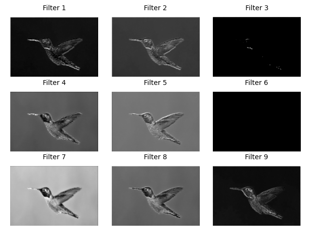
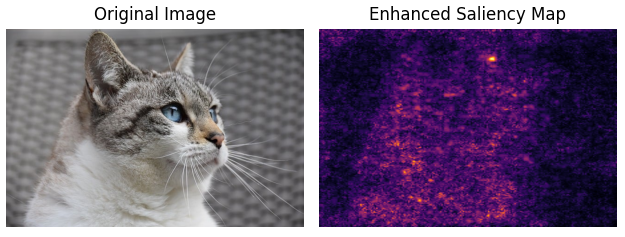

# Vision Specialized Laboratory

This is the experimental sections about torch vision. We'll hands on some simple labcodes to get an intuition about convolutional network.

* [feature maps](#feature-maps)
* [saliency maps](#saliency-maps)
* [class activation maps](#class-activation-maps)

### Feature Maps

What's the output of the conv layer? What do they do after images pass through a conv layer and max pool? How do filters affect the results? We'll retrieve the output of a layer and display every channel using plot, that's called `feature maps`.

#### feature_map.py

```python
# read the image
image = Image.open(current_dir / "imgs/bird.jpg")
# convert to tensor
image_tensor = transforms.ToTensor()(image)

# display
# utils.plot_image(image_tensor)

# conv block
conv_block = nn.Sequential(
    nn.Conv2d(in_channels=3, out_channels=16, kernel_size=3, stride=1, padding=1),
    nn.ReLU(),
    nn.MaxPool2d(kernel_size=2, stride=2),
    nn.Conv2d(in_channels=16, out_channels=9, kernel_size=3, stride=1, padding=1),
    nn.ReLU(),
    nn.MaxPool2d(kernel_size=2, stride=2)
)
# apply the convolutional layer to the image
output_conv_layer = conv_block(image_tensor)

utils.plot_channels(output_conv_layer)
```




### Saliency Maps

Take a example for image classification, which of those pixels by input has big influence on the prediction? How do we visualize them? That comes to `saliency maps` which can measure input images pixel by pixel to reveal which parts most affect the prediction.



### Class Activation Maps

Instead of showing high lights of pixels, with `Grad-CAM` (Gradient weighted Class Activation Mapping), we can show regions on original image with influences. That make more sense. 

The main idea is based on feature maps. Since each feature map represents from a special angle, all the feature maps reflects what a neural network seen. Therefore we grab the activations from last layer which directly affects prediction, also with backward gradients.
Calculate average gradients as weights of correlative feature map, then sum up all the feature maps multipled by their weights. Finally smoothing with interpolation and stack back to the top of original image, we got our heat map.

**Note:** There're two ways of using hook to grab gradient.

1. You can register your hook function on target layer by using `register_forward_hook` and `register_full_backward_hook`
2. You can register hook **ONLY FOR** target tensor with `register_hook`


