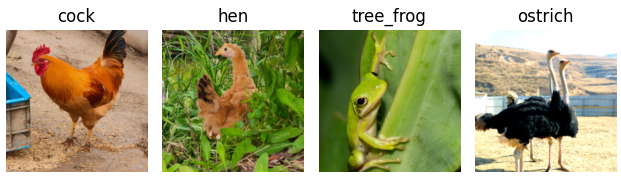
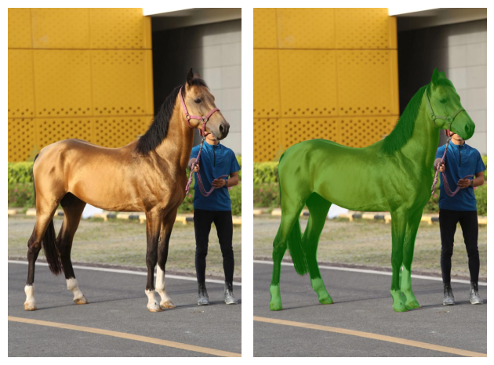
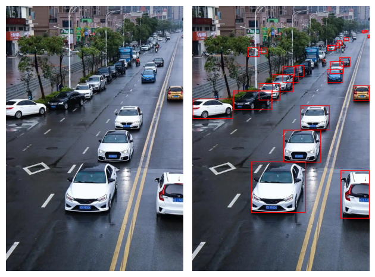
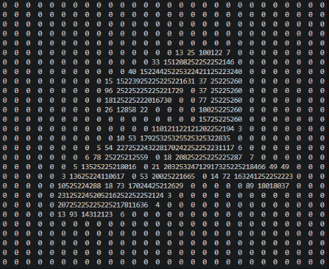
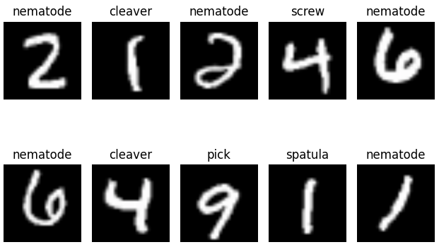

# Pretrained models with Pytorch in action

By the power of `torchvision` library, we can make use of most famous models effortlessly into projects.
We can do inference directly with pre-trained parameters or we can do transfer learning and fine-tuning with them to adapter to our cases.
Here we inspect the modules to understand their architecture and make some practicals in object prediction, segmentation and detection with some of pre-trained models.

## Scripts Content Introduction

### resnet50_prediction.py

We use `Resnet50` model to predict image content. Instead of using `pretrained=True` parameter to download file online instantly, we try to pre-download `resnet50-0676ba61.pth` and `imagenet_class_index.json` first and load them offline manually.

With the model ready, we provide images and do transforms to make predictions, verify the ability of the model.
Also we need to denormalize the cropped images and matching the category_id with class names, eventually show them up to visualize the results.




### deeplabv3_resnet50_segmentation.py

Based on `DeepLabV3` model, we do image segmentations by `torchvision.utils.draw_segmentation_masks`.

In order to make sure the items model supported, we read classes from weights meta:

```text
['__background__', 'aeroplane', 'bicycle', 'bird', 'boat', 'bottle', 'bus', 'car', 'cat', 'chair', 'cow', 'diningtable', 'dog', 'horse', 'motorbike', 'person', 'pottedplant', 'sheep', 'sofa', 'train', 'tvmonitor']
```

There're total 21 classes including `__background__`. We choose a horse to do the experiment.

Supply a custom image which contains a horse, define the target object and mask colors, convert it to tensor and feed into the model to get individual pixel probabilities and calculate the mask.

Comparision shows below:




### faster_rcnn_resnet50_detection.py

Use the power of `Fast R-CNN` model to perform object detection. The popular model combines components:

* Faster R-CNN (Region-based Convolutional Neural Network)
* ResNet-50
* FPN (Feature Pyramid Network): an effective multi-scale detection strategy

First load the model with pre-trained weights, set up target list and a `Threshold` to filter out uncertain detections.
Then feed the model with input image, get outputs of potential bounding boxes for detected objects and assigned scores.
Drawing with `torchvision.utils.draw_bounding_boxes` method.

The results would be a little different according to `threshold` values, here we choose 0.7 to be more confident, but as you can see not all of the cars in images was detected correctly somehow. Maybe needing more adjustment and post-training.



**Caution:**

Unlike `DeepLabV3` the input to `fasterrcnn_resnet50_fpn` model in Pytorch do not need normalized at first, only convert image to tensor and scaled to 0~1 is enough, otherwise you'll get problems with detection results.


### mobile_net_v3_fine_tuning.py

It's common situations you should take a pretrained model and adapt it to your target, instead of training one from scratch. Transfer learning leverage the pretrained model's power. We could keep the backbone and replace some of the layers, take further small step of training, eventually end up with a satisfied one.

Transfer learning can save lots of training time and computational resources. You can benefit from its general knowledges and well designed architectures.

In the script, I use `mobilenet_v3_small`, a tiny network pretrained on ImageNet, to predict handwritten digits on `MNIST` dataset which I printed a sample in console like below. It's a single channel gray scale image.



Although both are image prediction, the training dataset content were a huge vary. As expected, it won't work well and makes lots of incorrect predictions. Here comes the transfer learning, we replace some of the top layers of classifier, then retrained it with new dataset. Just for a few couple of epochs, it will do a brilliant work.

**Predicting without transfer learning**



As you can see, training on ImageNet won't help it recognizing the gray simple digits.

