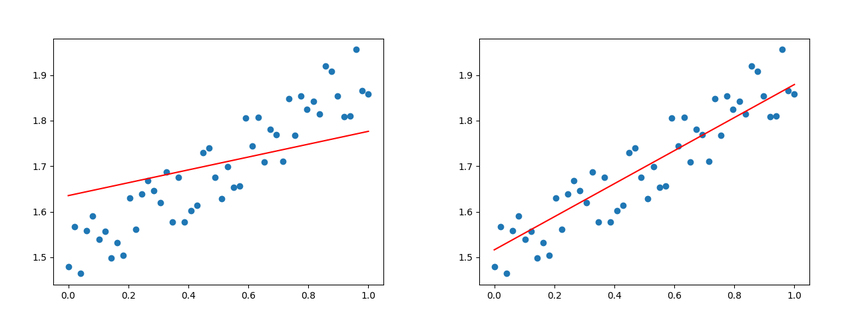
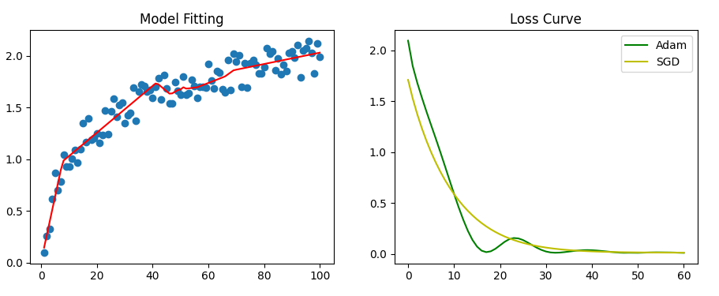

### Hands on: fundations for Pytorch
* simple_linear_dynamic.py

简单的一元变量线性拟合样例，展示了基础的数据训练过程。
其中使用了 matplotlib 进行训练过程的动态可视化展现，更易于观察整个训练过程的渐进逼近。

摘要：
1. nn.Linear
2. torch.linspace
3. squeeze / unsqueeze
4. torch.rand 及数据分布平移和缩放
5. matplotlib 动态绘图 fig.set_data + plt.pause
6. .detach.numpy()

效果示例：

* simple_curve_dynamic.py

使用多层网络结构，拟合 log10 曲线。
增加了更大范围的数据值，同时需要进行数据 Normalize 归一化，否则不同量度的范围值造成梯度消失，训练失败。

摘要：
1. torch.log10
2. BatchNorm1d
3. plt.subplots 多子图
4. Adam vs. SGD

效果示例：

