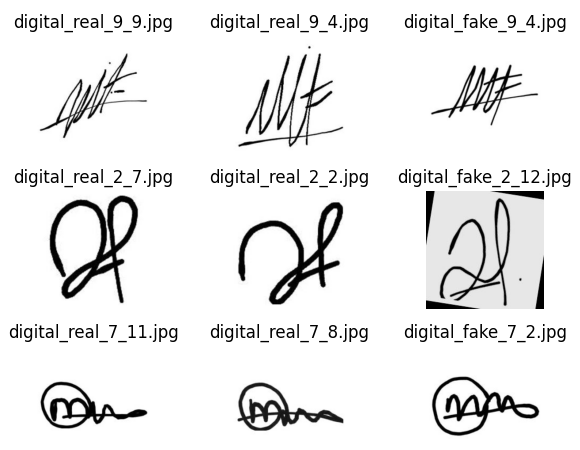
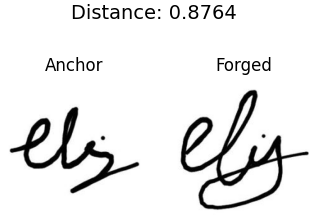
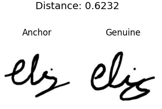

# Siamese Network Application

Here comes in a different architecture of the network which ingest two or more inputs, learn a similarity function to measure distance between items in the same feature space.
The core technique is multi inputs going through an identical network and share the same parameters. The output embedding space eventually pull the similar items closer and push dissimilar items apart.

## Signature Verification

This is a common scenario with security implications to identify whether two signatures come from the same person, in other words to say it is genuine or forged.

~~We'll use datasets of [handwritten signatures](https://www.kaggle.com/datasets/divyanshrai/handwritten-signatures) from Kaggle.com.~~

It's a little bit hard to find satisfied dataset which is well organized in right shape and format. We finally use a subset of [Signature Verification_v5.v11](https://universe.roboflow.com/signature-verification-online-and-offline/signature-verification_v5/dataset/11) and re-organized it somewhat by manually in order to get right pairs of genuine and forged.

The dataset has already been resize in 224x224 uniform, and augmented in rotation, brightness and blur. But not organized in pairs, so based on it, we do some efforts with image names to make training pairs.



We will train the model by using triplets: an **anchor**, a **positive**, and a **negative**. The aim is to teach the model to minimize the distance between the Anchor and Positive while maximizing the distance between the Anchor and Negative.
The corresponding loss function will be `nn.TripletMarginLoss`. 

```python
# set margin value to 1.5, using L2 Norm, means will be more sentive to noise
triplet_loss = nn.TripletMarginLoss(margin=1.5, p=2)
```

The main components are:

* **SignatureTripletDataset** : a custom dataset which manage a `userid->signatures` map, using it to load signature images by person and turn them to triplets with transforms in tensor format.
* **SimpleEmbeddingNetwork** : the backbone of the siamese network. It use convolutional networks to encode signatures.
* **SiameseNetwork** : the top architecture, using the `SimpleEmbeddingNetwork` to encode inputs.

It's not like the classification task, the network won't classify any signatures to one person. This enables the model can make prediction on any unseen data.

In our procedure, we train on separated dataset and test on another unseen data before. Suppose we set `threshold=0.7` then test results will be:

  


